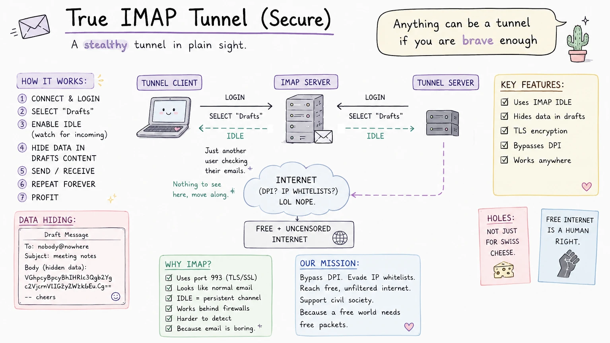

# True IMAP Tunnel (secure)



**True IMAP Tunnel (secure)** is a TCP tunnel that hides arbitrary TCP streams inside IMAP draft
messages. It does **not send emails**: no SMTP, no recipients, no delivery.
It only logs in to IMAP, writes draft-like messages into private folders, reads
them from the other side, and deletes them after processing. Your mail server becomes the world's least suspicious packet queue.

It can run as a standalone Go binary on both ends, or as a Shadowsocks SIP003
plugin for clients such as Shadowsocks Android.

The tunnel does not care what TCP protocol you put through it: SOCKS5 (e.g. Dante),
VLESS (Xray/sing-box), SSH, etc. Point the server
side at a TCP endpoint, point the client side at a local listening port, and the
tunnel does the dirty work.

Some ideas here grew out of my other project,
[yac-ws-bridge / Bridge To Freedom](https://github.com/noiseonwires/yac-ws-bridge),
which tunnels traffic over YC serverless functions via WebSockets.

## How it works

```text
local app -> client TCP listener -> IMAP folders -> server -> target TCP service
local app <- client TCP listener <- IMAP folders <- server <- target TCP service
```

Both endpoints log in to the same IMAP account(s). For each account, two IMAP
folders are used: one direction for client-to-server frames and one direction
for server-to-client frames. These are just IMAP-stored draft messages in
dedicated folders; no message is ever submitted for delivery.

The protocol frames are small binary records:

```text
+--------+----------+---------+----------+
|  type  | streamID |  seqID  | payload  |
| 1 byte | 4 bytes  | 4 bytes | variable |
+--------+----------+---------+----------+
```

Frame types are `OPEN`, `OPEN_OK`, `OPEN_FAIL`, `DATA`, `FIN`, `RST`, `PING`,
and `PONG`. The client opens one logical stream per accepted TCP connection.
The server receives `OPEN`, dials its configured `target`, and both sides then
relay `DATA`/`FIN`/`RST` frames until the TCP stream closes.

Frames are encoded into draft messages and APPENDed to the send folder. The
receiver SELECTs its receive folder, waits with IMAP `IDLE` when available,
FETCHes new drafts, decodes frames, dispatches them to streams, marks handled
messages `\Deleted`, and EXPUNGEs them later in batches.

Some IMAP servers do not support `IDLE`.Tunnel client falls back to polling in that
case, and even IDLE mode has a bounded safety fetch so provider-side IDLE time
limits or missed notifications cannot stall the tunnel indefinitely. If you can
choose the mail provider/server, prefer one with solid IMAP IDLE support and
ordered cross-session visibility.

Optional `encryption_passphrase` enables AES-256-GCM frame encryption before
frames are stored in IMAP. Empty passphrase means encryption is disabled.

To change how each tunnel draft looks to anyone browsing the IMAP folder in a
normal mail client (subject, attachment vs plain-text body, custom filename), see
[`docs/configuration.md`](docs/configuration.md#customizing-how-messages-look-in-the-mailbox).

## Provider notes (personal experience)

Anecdotal, your mileage may vary:

- **Gmail** — slow, but manageable for everyday use.
- **Outlook** - same, but requieres OAuth.
- **Seznam.cz** — no `IDLE` support, works fine with polling still.
- **Mail.ru** — fast and stable. Best experience so far.
- **Yandex** — terribly slow and tends to die after a minute. If you know why - PRs are welcome.

## Build

Requirements:

- Go 1.24+ (maybe older versions will work too, I didn't test) for the standalone binary.
- Android SDK + Gradle only if building the Shadowsocks plugin APK.

Build the Go binary:

```powershell
go build -trimpath -o .\bin\true-imap-tunnel.exe .\cmd\true-imap-tunnel
```

On Linux/macOS:

```sh
go build -trimpath -o ./bin/true-imap-tunnel ./cmd/true-imap-tunnel
```

Run tests:

```powershell
go test .\...
```

## Configuration, examples, and diagnostics

Standalone client/server YAML examples, IMAP folder advice, config option notes,
multipath notes, and troubleshooting steps now live in
[`docs/configuration.md`](docs/configuration.md).

The short version: run one binary in `server` mode near the TCP service you want
to expose, run another in `client` mode where you want the local listening port,
and use mirrored `folder_send` / `folder_recv` values on both sides.

## Shadowsocks SIP003 plugin

It can also run as a Shadowsocks SIP003 plugin, including on Shadowsocks
Android. The plugin-specific setup, Android hints, URL formats, and APK build
steps live in [`android-plugin/README.md`](android-plugin/README.md).

## License

Copyright (C) 2026 [Kirill aka `noiseonwires`](https://github.com/noiseonwires).

GNU Lesser General Public License v3.0 or later. See [`LICENSE`](LICENSE).

And yes, the acronym is intentional.
